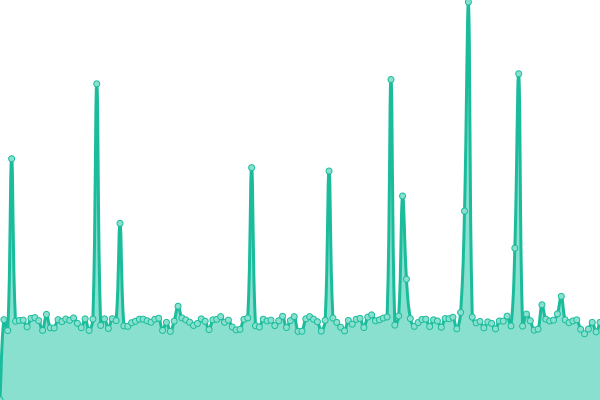

# [📈 Live Status](https://uptime.r3f.cn): <!--live status--> **🟧 部分停机**

This repository contains the open-source uptime monitor and status page for [r3f](https://uptime.r3f.cn), powered by [Upptime](https://github.com/upptime/upptime).

With [Upptime](https://upptime.js.org), you can get your own unlimited and free uptime monitor and status page, powered entirely by a GitHub repository. We use [Issues](https://github.com/r3f/upptime/issues) as incident reports, [Actions](https://github.com/r3f/upptime/actions) as uptime monitors, and [Pages](https://uptime.r3f.cn) for the status page.

<!--start: status pages-->
<!-- This summary is generated by Upptime (https://github.com/upptime/upptime) -->
<!-- Do not edit this manually, your changes will be overwritten -->
<!-- prettier-ignore -->
| 链接 | 状态 | 历史 | 响应时间 | 正常运行时间 |
| --- | ------ | ------- | ------------- | ------ |
|  iKuai | 🟩 正常运行 | [i-kuai.yml](https://github.com/r3f/upptime/commits/HEAD/history/i-kuai.yml) | 

 313毫秒
     
 | 

<a href="https://uptime.r3f.cn/history/i-kuai">100.00%</a>
    

|  Home Assistant | 🟥 停机 | [home-assistant.yml](https://github.com/r3f/upptime/commits/HEAD/history/home-assistant.yml) | 

 728毫秒
     
 | 

<a href="https://uptime.r3f.cn/history/home-assistant">52.49%</a>
    

|  ESXi | 🟩 正常运行 | [es-xi.yml](https://github.com/r3f/upptime/commits/HEAD/history/es-xi.yml) | 

 226毫秒
     
 | 

<a href="https://uptime.r3f.cn/history/es-xi">100.00%</a>
    

<!--end: status pages-->

[**Visit our status website →**](https://uptime.r3f.cn)

## 📄 License

- Powered by: [Upptime](https://github.com/upptime/upptime)
- Code: [MIT](./LICENSE) © [r3f](https://uptime.r3f.cn)
- Data in the `./history` directory: [Open Database License](https://opendatacommons.org/licenses/odbl/1-0/)
